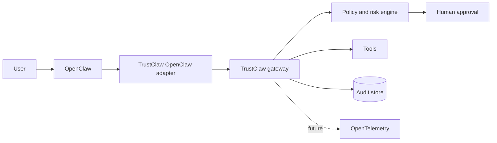

# TrustClaw

Trust, governance, and provenance for autonomous AI systems.

TrustClaw is an experimental trust plane for [OpenClaw](https://openclaw.ai/). It evaluates tool calls before execution, routes risky actions through human approval, and writes a tamper-evident audit history. The first milestone uses a simulated tool and in-memory adapters.

## The problem

Agent runtimes are getting better at taking action, but operators still need production-grade answers to a different set of questions:

- Is this agent allowed to perform this action?
- Who approved it?
- Which policy and identity were used?
- What happened, and can an auditor verify the record later?

TrustClaw applies familiar distributed-systems controls—identity, policy, observability, and auditability—to autonomous agents.

## Why now?

Tool-using agents increasingly touch email, files, infrastructure, and business systems. Observability can explain what happened after the fact; TrustClaw's goal is to combine that evidence with enforcement before a consequential action runs.

## Why OpenClaw?

OpenClaw provides the agent runtime and a TypeScript plugin model. TrustClaw is designed as a complementary control plane, beginning with an OpenClaw adapter and keeping its governance contracts runtime-neutral.

## Demo target

The first milestone is a single end-to-end scenario:

1. A user asks OpenClaw to delete email older than one year.
2. TrustClaw intercepts the tool call and assigns medium risk.
3. A human approves the request.
4. A simulated handler executes the action.
5. The request, decision, approval, execution, and outcome appear in one audit chain.
6. A tamper-evident audit event is persisted.

## Architecture



See [the architecture notes](docs/architecture.md), [audit event schema](docs/audit-event.schema.json), and [roadmap](ROADMAP.md).

## Implemented milestone

The first executable vertical slice:

- Converts a simulated `gmail.delete_email` proposal into a runtime-neutral authorization request.
- Snapshots the proposed action before any asynchronous adapter call, canonicalizes it, and binds approvals to its SHA-256 digest and expiration.
- Applies a versioned deterministic policy: year-old email deletion is medium risk; bulk deletion above the configured threshold is critical and requires two distinct approvers.
- Executes only after sufficient valid approval and never contacts Gmail.
- Records request, decision, approval, execution, and outcome events in an in-memory SHA-256 hash chain.
- Verifies valid chains and detects changed, reordered, removed, or incorrectly linked events.

The chain is tamper-evident, not immutable. An attacker who can rewrite all in-memory state is outside this milestone's guarantees.

## Setup and demos

Requirements: Node.js 24 and pnpm 11.

```bash
pnpm install
pnpm format:check
pnpm lint
pnpm typecheck
pnpm build
pnpm test
pnpm demo
pnpm demo:tamper
```

`pnpm demo` uses a documented non-interactive approval suitable for CI. Run `pnpm demo:interactive` to answer the approval prompt yourself. Every tool action is simulated.

The bulk-delete threshold has no implicit default and must be configured. The
value in `config/policy.example.json` is synthetic demo data, not a production
recommendation.

## Stack

- Node.js 24 and TypeScript ESM
- pnpm
- OpenClaw-compatible adapter boundary; the SDK is not installed yet
- TypeBox/JSON Schema for contracts
- Vitest
- ESLint and Prettier

The implementation uses interfaces so PostgreSQL, OpenTelemetry, and an OpenClaw adapter can be added later. They are not dependencies of this milestone.
Policy, approval, tool, and audit adapters may be synchronous or asynchronous;
the gateway awaits either form.

## Status

Milestone 1 is executable and tested, but remains a local demonstration—not a production-ready security boundary.

## License

[Apache License 2.0](LICENSE)
