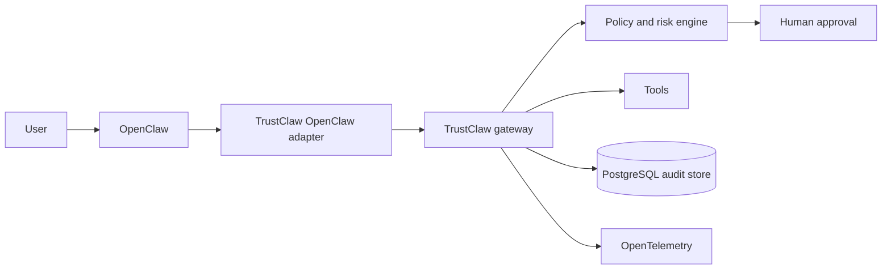

# TrustClaw

Trust, governance, and provenance for autonomous AI systems.

TrustClaw is an experimental trust plane for [OpenClaw](https://openclaw.ai/). It evaluates tool calls before execution, routes risky actions through human approval, emits OpenTelemetry traces, and writes a tamper-evident audit history.

## The problem

Agent runtimes are getting better at taking action, but operators still need production-grade answers to a different set of questions:

- Is this agent allowed to perform this action?
- Who approved it?
- Which policy and identity were used?
- What happened, and can an auditor verify the record later?

TrustClaw applies familiar distributed-systems controls—identity, policy, observability, and auditability—to autonomous agents.

## Why now?

Tool-using agents increasingly touch email, files, infrastructure, and business systems. Observability can explain what happened after the fact; TrustClaw's goal is to combine that evidence with enforcement before a consequential action runs.

## Why OpenClaw?

OpenClaw provides the agent runtime and a TypeScript plugin model. TrustClaw is designed as a complementary control plane, beginning with an OpenClaw adapter and keeping its governance contracts runtime-neutral.

## Demo target

The first milestone is a single end-to-end scenario:

1. A user asks OpenClaw to delete email older than one year.
2. TrustClaw intercepts the tool call and assigns medium risk.
3. A human approves the request.
4. OpenClaw executes the action.
5. The request, decision, approval, execution, and outcome appear in one trace.
6. A tamper-evident audit event is persisted.

## Architecture

See [the architecture notes](docs/architecture.md), [audit event schema](docs/audit-event.schema.json), and [roadmap](ROADMAP.md).

## Planned stack

- Node.js 24 and TypeScript ESM
- pnpm
- OpenClaw plugin SDK
- PostgreSQL
- OpenTelemetry, with an OTLP-compatible backend such as Jaeger or Grafana Tempo
- TypeBox/JSON Schema for contracts
- Vitest

This matches OpenClaw's source and plugin development conventions. Policy evaluation starts as deterministic TypeScript rules; an OPA adapter remains a later option if the demo proves the need.

## Status

Design phase. There is intentionally no executable product code yet.

## License

[Apache License 2.0](LICENSE)

